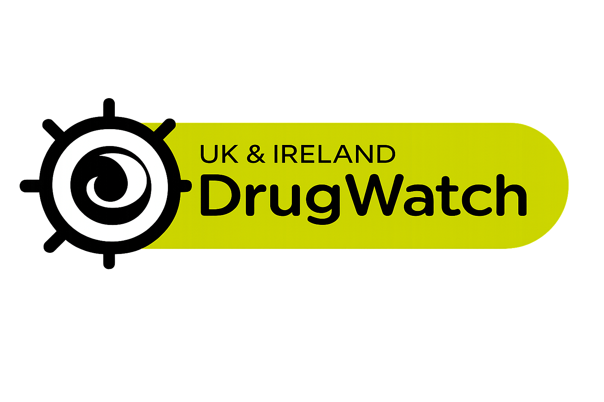

# psy.cards

`psy.cards` is a multilingual harm reduction card project that turns verified knowledge bases into compact, readable guidance across print, web, and social media formats. 

The goal is to make high-quality substance information easier to access, easier to translate, and easier to distribute responsibly across Europe.

## Constraints and Scope

The project is designed around strong space constraints: each format must surface the most important information clearly, whether it appears on a printed card, in a carousel post, or behind a QR code on the web. Alongside substance-specific cards, the system will also support shared harm reduction content such as preparation, set and setting, integration prompts, common effects, and local support resources.

## Channels

- `Print (Standard)`: affordable large-run card sets for festivals, outreach teams, and partner organisations.
- `Print (Premium)`: higher-quality boxed editions for supporters, gifting, and crowdfunding rewards.
- `Instagram`: localised carousel-friendly versions for `@psychedelicards` and language-specific accounts.
- `Web`: mobile-friendly reference pages linked from QR codes and backed by transparent sources.
- `AI / Chatbot`: a later safety-focused conversational layer for questions such as dosage, interactions, and risk reduction.

## Roadmap

- `Q2 2026`: define the core data model, card template, and multilingual publishing workflow.
- `Q3 2026`: launch the first web companion and first standard printed card sets.
- `Q4 2026`: expand language coverage and prepare premium print editions, packaging, and art direction.
- `End of 2026`: deliver a stable print-first system with QR-linked web support.
- `Early 2027`: prototype and launch an initial source-grounded AI/chatbot for tightly scoped harm reduction Q&A.

## Local Development

All commands run from the project root:

| Command | Action |
| :-- | :-- |
| `pnpm install` | Install dependencies |
| `pnpm dev` | Start the local dev server |
| `pnpm build` | Build the production site |
| `pnpm preview` | Preview the production build locally |

## Acknowledgements

`psy.cards` is standing on the shoulders of projects and communities that have already done essential harm reduction, research, and public education work.

| [TripSit](https://tripsit.me) | [PsychonautWiki](https://psychonautwiki.org) | [Drugwatch](https://www.drugwatch.org) |
| :--: | :--: | :--: |
|  |  |  |
